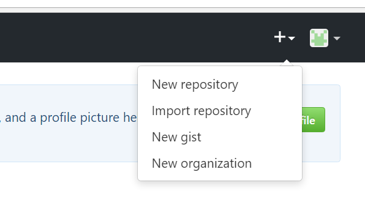

## Reference WebSite

将Mkdocs生成的网站发布到Github上，可以参考教程[Configuring a publishing source for GitHub Pages](https://help.github.com/articles/configuring-a-publishing-source-for-github-pages/)

## 1. 在Github上新建仓库

申请Github账号，并且新建仓库，仓库名称必须为 username.github.io 

* 新建仓库



* 命名为 username.github.io


## 2. 在本地新建Github项目
```
echo "# username.github.io" >> README.md
git init
git add README.md
git commit -m "first commit"
git remote add origin https://github.com/username/username.github.io.git
git push -u origin master
```
进入mkdocs项目下，生成site目录：
```
mkdocs build
```
将生成的site目录拷贝到Github项目目录，用以下命令将所有文件push到Github的username.github.io仓库中
```
git add *
git commit -m "add site files"
git push -u origin master
```
## 3. 访问生成的网页

访问http(s)://username.github.io 就可以进入生成的网页了

First Header | Second Header | Third Header
:----------- |:-------------:| -----------:
Left         | Center        | Right
Left         | Center        | Right


